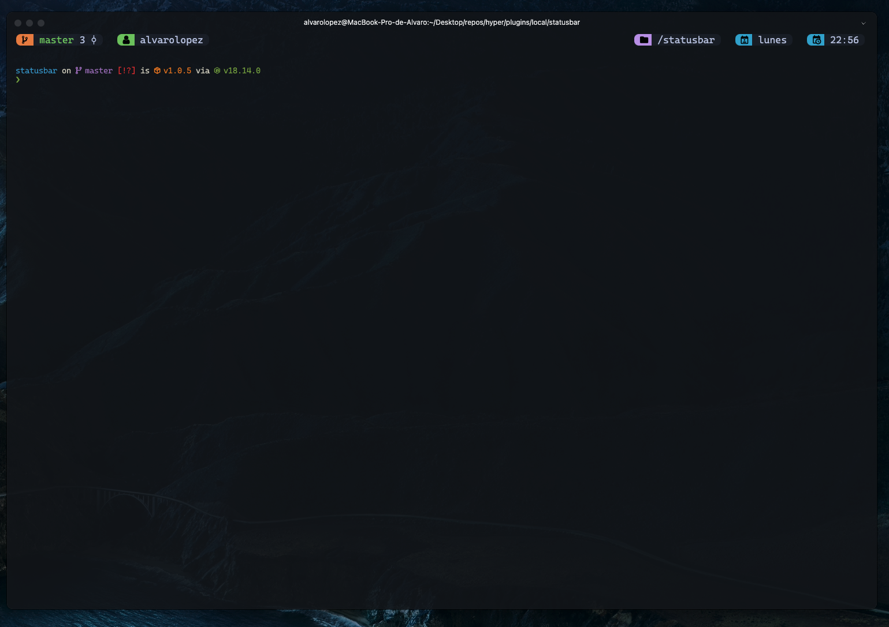
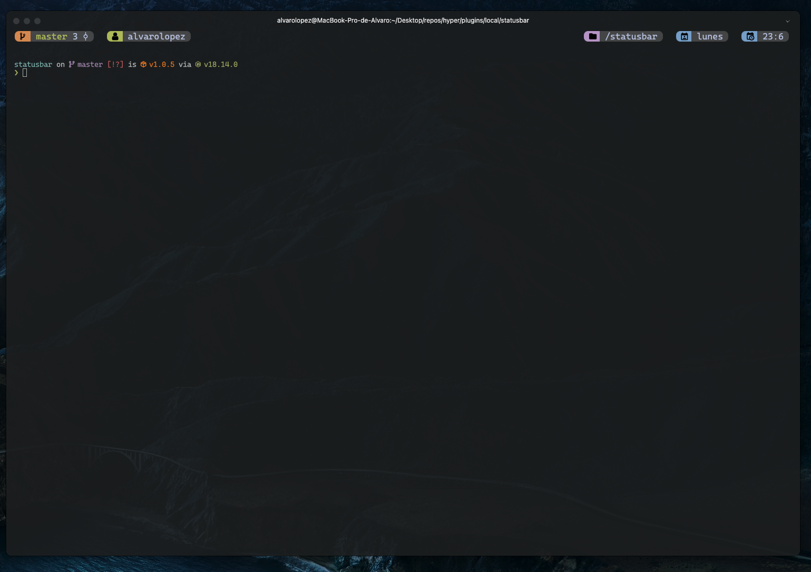
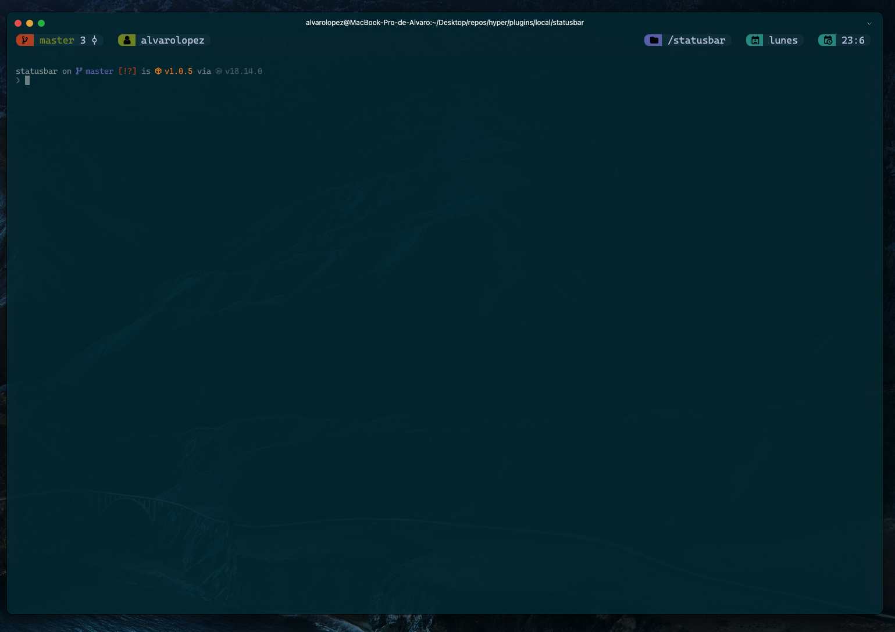
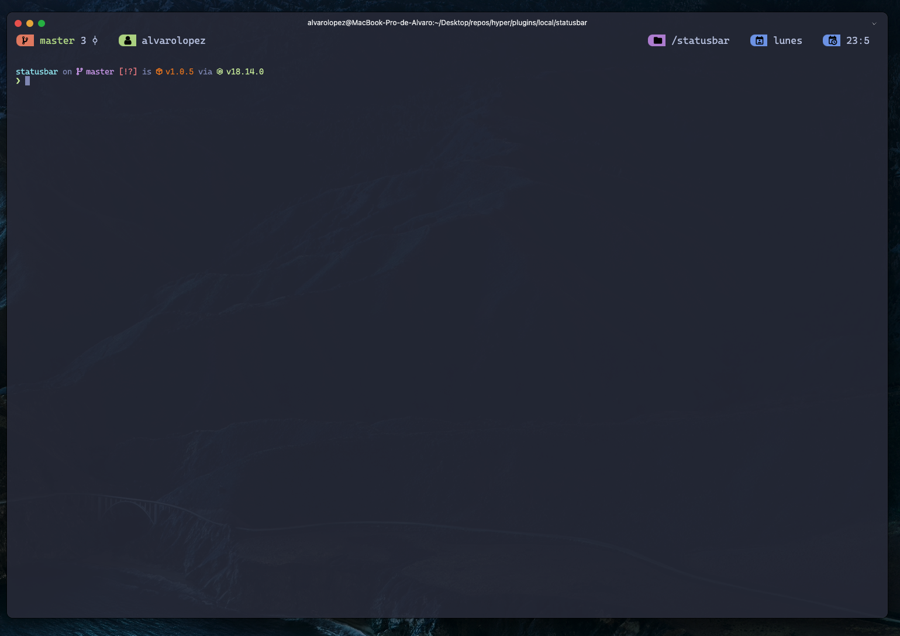
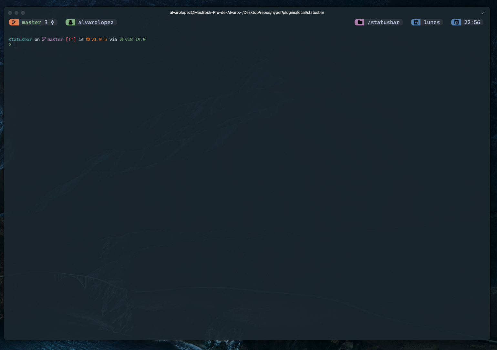
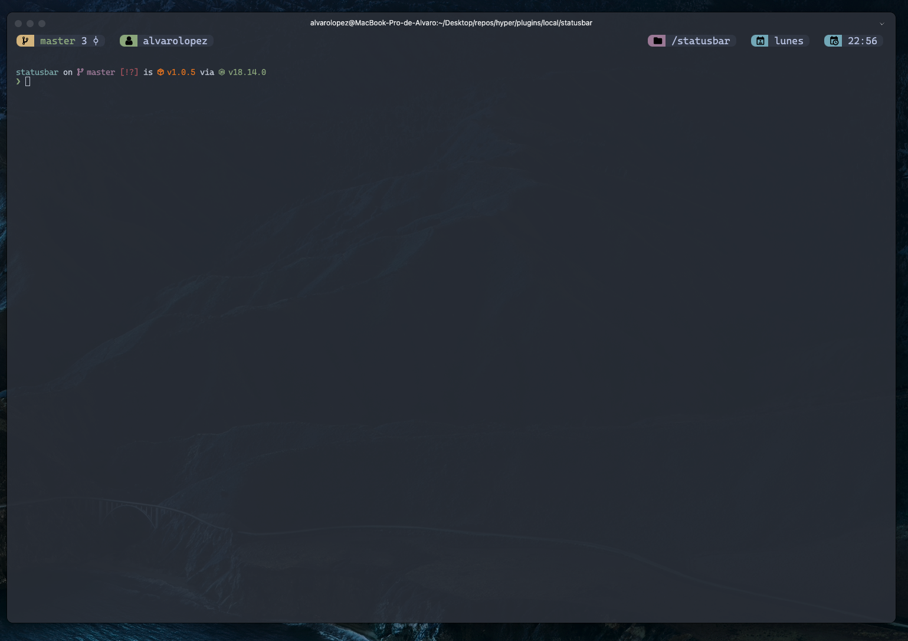
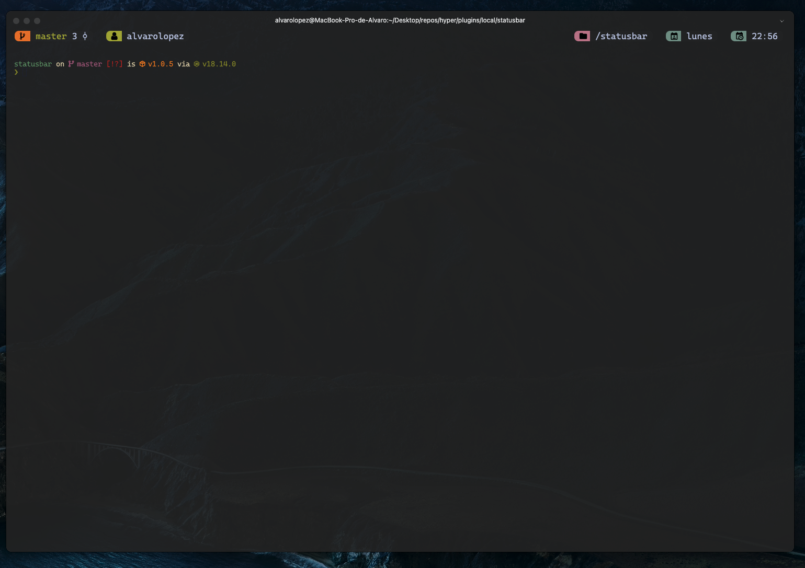
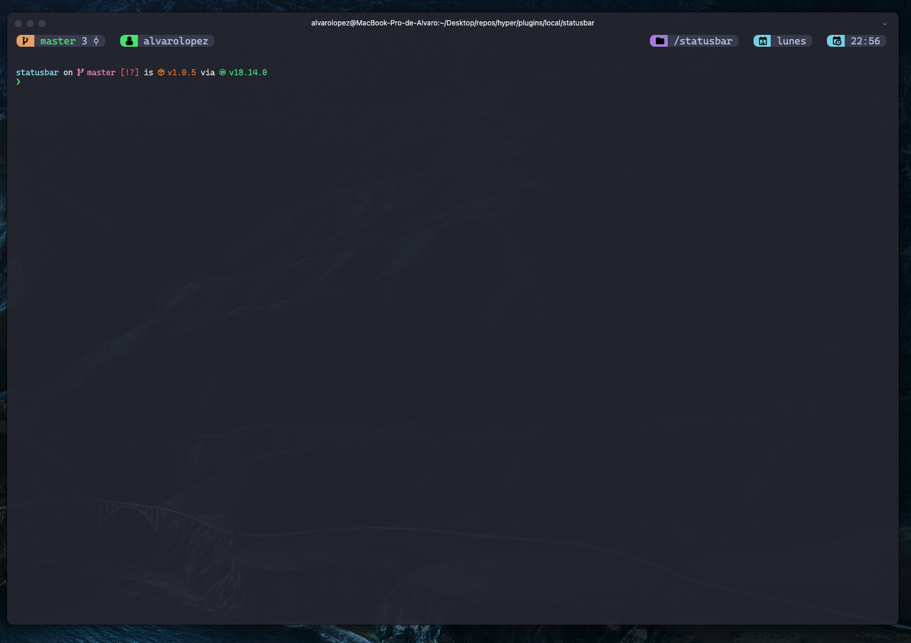
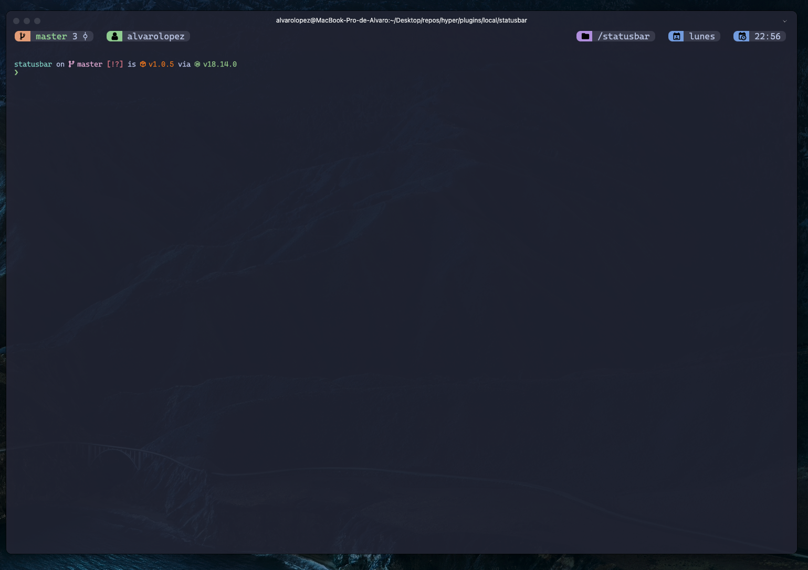

# Hyper Terminal Plugin: hyper-statusbar

[](https://www.npmjs.com/package/hyper-statusbar)\
[](https://github.com/riigarXX/hyper-statusbar/releases)\
[](https://github.com/riigarXX/hyper-statusbar/commits)\
[](https://github.com/riigarXX/hyper-statusbar/stargazers)\
[](https://github.com/riigarXX/hyper-statusbar/network/members)\
[](https://www.npmjs.com/package/hyper-statusbar)

## Overview

Elevate your Hyper terminal experience with the Hyper Statusbar plugin. This sleek addition provides essential information right at your fingertips.

### Key Features

* **Branch Awareness:** Stay in the loop with your current Git branch and any pending changes.
* **User Identification:** Instantly know whether you're logged in as a regular user or root.
* **Directory Display:** Keep track of your current working directory.
* **Time and Date:** Never lose track of time with a convenient timestamp, complete with a weekend indicator (palm tree icon).
* **Color Themes:** Choose from a variety of vibrant color themes to match your style.

## Usage

### Installation

Modify your `.hyper.js` file and add our plugin to the plugins array: `hyper-statusbar`.

```javascript
// ~/.hyper.js
module.exports = {
  ...your hyper.is config
  plugins: [
    "hyper-statusbar"
  ],
};
```

## Customization

Customize the appearance of your Hyper terminal's status bar to match your preferences.

```javascript
// ~/.hyper.js
module.exports = {
  config: {
    statusbar: {
      fontFamily: "CaskaydiaCove Nerd Font",
      theme: "palenight", // Example theme, choose your favorite from the list
    },
  },
  plugins: ["hyper-statusbar"],
};
```

## Screenshots / Usage

<details>
<summary>View Screenshots</summary>

Explore different themes with the Hyper Statusbar plugin:

### Ayu Theme



### Tomorrow Night Theme



### Solarized Dark Theme



### Palenight Theme



### One Dark Theme


### Oceanic Next Theme



### Nord Theme



### Gruvbox Theme



### Dracula Theme



### Cattpuccin Theme



</details>

## Let's Wrap It Up!

Congratulations on discovering Hyper Statusbar, your trusty companion in the world of terminal customization! With Hyper Statusbar, you're not just customizing your terminal – you're crafting your own cozy corner of the coding universe.

Got questions, ideas, or just want to say hi? We're all ears! Swing by our [GitHub page](https://github.com/riigarXX/hyper-statusbar) and join the conversation. Together, let's make coding a little more colorful and a lot more fun!

Happy coding, friend! ✨

With love from riigarXX 💖


## License 📄

This project is licensed under the MIT License - see the [LICENSE](LICENSE) file for details.
